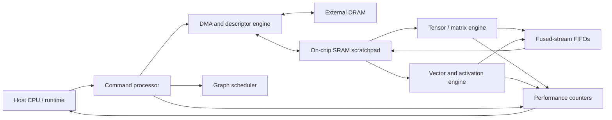
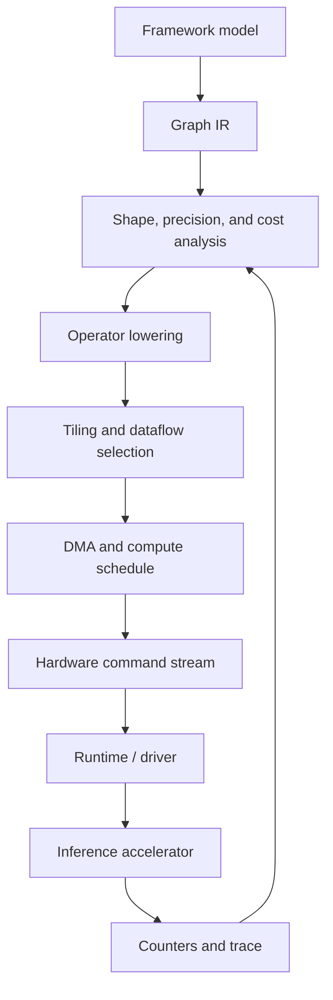

# Design Chips for Inference Acceleration

> *The fastest neural-network chip is not the one with the biggest multiply array. It is the one that spends the least time waiting for data, doing useless work, or asking the compiler for forgiveness.*

This guide explains how to design a chip for neural-network inference acceleration. It is written as a **GitHub-ready engineering methodology document**, with compatible LaTeX, Mermaid diagrams, quantitative models, architecture tradeoffs, and staged implementation milestones.

The goal is not to copy a named accelerator. The goal is to learn how to move from a workload and a constraint envelope to a defensible hardware architecture.

A useful starting point is the distinction between **compute**, **data movement**, and **control**. Modern inference accelerators often contain specialized tensor or convolution engines, on-chip buffers, configurable data paths, and a software stack that maps model operations to hardware. NVDLA, for example, exposes independently configurable engines for convolution, activation, pooling, normalization, reshape, and data movement, while also supporting fused pipelines that can avoid unnecessary round trips through external memory.[1] The TPU literature demonstrates why workload-level throughput, memory, and power matter more than peak arithmetic count alone.[2]

> **Scope note:** this guide covers architectural design and evaluation. It does not provide a fabricated tape-out plan, a process-design kit, foundry recipe, or guarantee that a proposed architecture is commercially competitive.

---

## The Design Problem

A neural-network inference accelerator must answer several questions simultaneously:

| Question | Design consequence |
| --- | --- |
| Which models must run? | Determines supported operators and shapes |
| What is the target latency? | Determines parallelism, buffering, and scheduling |
| What is the throughput target? | Determines batching, replication, and memory bandwidth |
| What is the power budget? | Determines voltage, frequency, precision, and data movement |
| What is the memory budget? | Determines tiling, compression, reuse, and off-chip traffic |
| What accuracy loss is acceptable? | Determines quantization and approximation policy |
| How programmable must the chip be? | Determines fixed-function versus reconfigurable hardware |
| Which compiler owns the mapping? | Determines tensor layouts, operators, and runtime contracts |
| How will the chip be verified? | Determines the ISA, reference model, traces, and test strategy |
| What is the deployment environment? | Determines host interface, thermal design, and reliability |

The design process should begin with a **workload contract**, not with “let us build a 128 by 128 systolic array.” The array is an implementation choice. The workload and constraints are the problem.

---

## The Target Architecture for This Guide

To keep the discussion concrete, this guide uses a reference target:

| Specification | Reference choice |
| --- | --- |
| Deployment | Edge server or embedded accelerator |
| Workloads | CNNs, MLPs, attention projections, and small transformer blocks |
| Main precision | INT8 activations and weights |
| Accumulation | Wider integer or mixed-precision accumulation |
| Compute core | Reconfigurable matrix-multiply engine |
| Memory | On-chip SRAM scratchpad plus external DRAM interface |
| Control | Host CPU plus command queue and descriptor engine |
| Data movement | DMA, tiling, double buffering, and optional fused paths |
| Programmability | Operator graph compiled into hardware commands |
| Primary objectives | Low latency, high utilization, low energy per inference |
| Correctness target | Model-level accuracy within a declared tolerance |

This is a teaching target. A production design might instead prioritize large-batch datacenter throughput, transformer decoding latency, safety-critical determinism, automotive reliability, or always-on sensor workloads.

---

## Core Philosophy

| Principle | What it means |
| --- | --- |
| **Workload first** | Measure representative models before choosing hardware dimensions |
| **Data movement is architecture** | SRAM capacity, reuse, layout, and bandwidth are first-class design decisions |
| **Utilization beats peak** | A smaller array that stays busy can beat a larger array that waits |
| **Precision is a contract** | Quantization must be validated at model level, not assumed from bit width |
| **The compiler is part of the chip** | Unsupported layouts or awkward tiling can make good hardware unusable |
| **Fusion is a bandwidth decision** | Combining operations matters when it removes material memory traffic |
| **Programmability has a cost** | Flexibility consumes area, power, control complexity, and verification effort |
| **Measure tails** | p99 latency and worst-case memory behavior matter in real systems |
| **Design for verification** | Every optimization needs a reference behavior and an observable trace |
| **Report energy per useful inference** | Do not hide idle, transfer, or host overhead outside the denominator |

---

## System-Level Architecture

A practical accelerator is not only a compute array. It is a system with software-visible state, memory interfaces, data movement, scheduling, and observability.



The host should submit work through a stable command interface rather than manipulating every internal register for every layer. The hardware should expose enough status and counters to explain why a workload is slow.

A good first hardware/software boundary is:

| Software owns | Hardware owns |
| --- | --- |
| Graph lowering and operator selection | Correct execution of supported commands |
| Tensor shapes and layouts | Tile movement and compute scheduling |
| Quantization parameters | Multiply, accumulate, saturation, and conversion semantics |
| Memory allocation plan | DMA transfer and buffering |
| Fusion decisions | Streamed handoff between compatible engines |
| Profiling interpretation | Hardware counters and completion events |
| Unsupported-operator fallback | Error reporting and safe abort |

---

## Step 1 — Characterize the Workload

Before designing a datapath, collect representative models and measure their layer-level behavior. A workload table should include:

| Field | Example |
| --- | --- |
| Operator | GEMM, convolution, attention, normalization, activation |
| Input shape | Batch, sequence, channels, height, width |
| Weight shape | Output channels, input channels, kernel dimensions |
| Precision | FP16, BF16, INT8, INT4, mixed |
| Operation count | MACs or equivalent arithmetic operations |
| Input bytes | Read traffic before reuse |
| Weight bytes | Read traffic before reuse |
| Output bytes | Write traffic before fusion |
| Reuse pattern | Weight, activation, partial-sum, or broadcast reuse |
| Dynamic behavior | Static shapes, variable sequence, sparsity, branches |
| Accuracy sensitivity | Tolerance to quantization or approximation |
| Latency importance | Median, p99, deadline, or throughput-oriented |

Do not sample only the easiest models. Include representative and adversarial cases:

| Workload class | Why it matters |
| --- | --- |
| Small convolutions | Expose array under-utilization and launch overhead |
| Large GEMMs | Reveal peak compute and bandwidth balance |
| Depthwise convolution | Tests non-dense data reuse and mapping efficiency |
| Attention projections | Tests matrix multiplication and sequence dimensions |
| Softmax and normalization | Expose vector, reduction, and precision requirements |
| Long-sequence decode | Exposes memory and latency behavior at small batch sizes |
| Irregular or sparse layers | Tests flexibility and compression overhead |

NVDLA documentation highlights how hardware atomic dimensions can cause low MAC utilization when layer dimensions do not align with the chosen channel and kernel granularities.[1] That is a general lesson: hardware shape is part of the workload model.

---

## Step 2 — Write the Quantitative Model

### Operation count

For a dense matrix multiplication:

$$
C_{M \times N} = A_{M \times K} B_{K \times N},
$$

there are approximately:

$$
\operatorname{MACs} = MKN,
$$

and twice as many arithmetic operations if one MAC is counted as a multiply plus an add:

$$
\operatorname{FLOPs\ or\ Ops} \approx 2MKN.
$$

For a two-dimensional convolution with output height $$H_o$$, output width $$W_o$$, input channels $$C_i$$, output channels $$C_o$$, and kernel size $$K_h \times K_w$$:

$$
\operatorname{MACs}
= H_o W_o C_o C_i K_h K_w.
$$

These formulas estimate arithmetic work. They do not estimate time until the architecture, utilization, memory, and scheduling are known.

### Arithmetic intensity

Arithmetic intensity measures operations per byte moved:

$$
I = \frac{\text{useful operations}}{\text{bytes transferred}}.
$$

If the accelerator has peak compute throughput $$P_{\max}$$ and sustainable memory bandwidth $$B$$, a simple roofline-style upper bound is:

$$
P_{\text{achievable}}
\leq \min(P_{\max}, B \cdot I).
$$

A layer with low arithmetic intensity is memory-bound. Adding more MAC units will not fix it unless reuse or bandwidth also improves.

### Latency

A first-order layer latency estimate can be written as:

$$
T_{\text{layer}}
\approx \max(T_{\text{compute}}, T_{\text{memory}})
+ T_{\text{launch}}
+ T_{\text{sync}}.
$$

The `max` is important. With double buffering and effective overlap, compute and transfer can proceed concurrently. Without overlap, the terms may add instead.

### Energy

A coarse energy model is:

$$
E_{\text{inference}}
= E_{\text{compute}}
+ E_{\text{SRAM}}
+ E_{\text{DRAM}}
+ E_{\text{interconnect}}
+ E_{\text{control}}
+ E_{\text{leakage}}.
$$

The values depend strongly on technology, voltage, physical distance, access width, and implementation. Use the equation to partition measurements, not to pretend that one universal energy-per-access table applies to every chip.

### Efficiency metrics

Report more than peak TOPS:

$$
\operatorname{Utilization}
= \frac{\text{useful executed operations}}
{\text{peak operations available}}.
$$

$$
\operatorname{Energy\ efficiency}
= \frac{\text{useful operations}}
{\text{joules}}.
$$

$$
\operatorname{Energy\ per\ inference}
= \frac{\text{total joules during the measured inference}}
{\text{completed inferences}}.
$$

Always state whether host time, input transfer, output transfer, warm-up, idle power, and compilation time are included.

---

## Step 3 — Choose the Compute Engine

### Scalar and vector units

Scalar and vector units are flexible and useful for control-heavy or elementwise operations. They can handle activations, reductions, indexing, normalization, and shape manipulation that a dense matrix engine may execute inefficiently.

### MAC arrays

A multiply-accumulate array is efficient for dense tensor operations. A two-dimensional array can stream operands through neighboring processing elements, reducing repeated access to a shared memory hierarchy.

A generic processing element may contain:

| Component | Role |
| --- | --- |
| Multiplier | Computes a product at the chosen precision |
| Accumulator | Sums products into a wider partial sum |
| Local registers | Retain operands and partial results |
| Data-valid control | Prevents invalid padded elements from corrupting results |
| Saturation / rounding | Implements declared numerical semantics |
| Optional zero detection | Skips or compresses sparse operands |

### Systolic-style dataflow

In a systolic array, operands and partial sums move through a regular grid. The regularity can simplify control and improve local reuse, but performance depends on matrix shapes, fill/drain overhead, and whether the compiler can tile the workload into compatible dimensions.

```
weights  →  PE  →  PE  →  PE
             ↓    ↓    ↓
activations  PE  →  PE  →  PE
             ↓    ↓    ↓
partial sums PE  →  PE  →  PE
```

The important question is not “does the chip have a systolic array?” It is “how often does the workload keep the array occupied with useful operands and partial sums?”

### Fixed-function versus reconfigurable

| Choice | Strength | Cost |
| --- | --- | --- |
| Fixed-function engine | High efficiency for known operators | Limited coverage and harder evolution |
| Reconfigurable array | Broader workload support | More control, routing, and verification overhead |
| Programmable vector core | Flexible fallback and control | Lower peak efficiency for dense tensor work |
| Heterogeneous combination | Matches each operator to a suitable engine | More complex compiler and memory coordination |

NVDLA uses a modular arrangement of specialized blocks and configurable hardware parameters, illustrating how fixed-function specialization can coexist with a broader inference graph.[1]

---

## Step 4 — Choose the Dataflow

Dataflow determines which values stay near compute and which values move through the memory hierarchy. Common choices include:

| Dataflow | Value kept local | Typical benefit |
| --- | --- | --- |
| Weight stationary | Weights | Reuses fixed model parameters across activations |
| Output stationary | Partial sums | Avoids repeatedly writing partial results |
| Activation stationary | Input features | Reuses activations across filters or consumers |
| Row stationary | A balanced combination | Exploits multiple reuse dimensions |
| Input / output streaming | Intermediate values | Reduces external-memory round trips in fused pipelines |

Eyeriss is a canonical reference for energy-aware dataflow and reuse decisions in convolutional accelerators.[3] The general lesson is that energy and performance depend heavily on where tensors travel, not only on how many multipliers exist.

For each operator, create a dataflow table:

| Tensor | Shape | Producer | Consumer | Reuse | Storage level |
| --- | --- | --- | --- | --- | --- |
| Input activation | `N x C x H x W` | Previous layer | MAC array | Spatial / temporal | SRAM tile |
| Weight | `K x C x R x S` | Model memory | MAC array | Across output positions | Weight buffer |
| Partial sum | `N x K x H_o x W_o` | MAC array | Accumulator | Across reduction dimension | PE registers / SRAM |
| Output | `N x K x H_o x W_o` | Accumulator | Next operator | Depends on fusion | FIFO or SRAM |

The dataflow is correct only if the compiler, buffer sizes, DMA schedule, and operator layout agree with it.

---

## Step 5 — Design the Memory Hierarchy

A typical hierarchy is:

```
External DRAM
    ↓ high capacity, high energy, high latency
Shared on-chip SRAM
    ↓ moderate capacity, lower energy, explicit management
Banked local buffers
    ↓ near-compute storage and parallel access
PE registers / accumulator files
    ↓ very small, very fast, specialized
Compute datapath
```

Each level should have a reason to exist. The design questions are:

| Question | Why it matters |
| --- | --- |
| How large is the buffer? | Determines which tiles fit and how much reuse is possible |
| How many banks exist? | Determines parallel access and conflict behavior |
| Which ports are available? | Determines read/write concurrency |
| Who controls movement? | Compiler, DMA engine, hardware scheduler, or a combination |
| Can transfer overlap compute? | Determines whether memory is hidden behind execution |
| What happens on a miss? | Determines stall behavior and tail latency |
| Are layouts transformed in memory? | Determines conversion cost and operator compatibility |
| What is the external bandwidth? | Sets the memory-bound ceiling |

The NVDLA architecture explicitly uses an internal convolution buffer to avoid repeated independent accesses to system memory and describes fused operation as a way to bypass memory round trips through small FIFOs.[1]

### Tiling

Tiling partitions a tensor into blocks that fit a local memory. For a matrix multiplication, choose tile sizes $$M_t$$, $$N_t$$, and $$K_t$$ such that:

$$
\operatorname{bytes}(A_t) + \operatorname{bytes}(B_t) + \operatorname{bytes}(C_t)
\leq \operatorname{SRAM}_{\text{available}}.
$$

The tile must also fit the compute array's preferred dimensions and preserve enough reuse to amortize movement. A tile that fits memory but creates poor array utilization is not a good tile.

### Double buffering

Double buffering keeps one buffer in compute use while another buffer is filled or drained:

```
buffer 0: compute tile t       ← active
buffer 1: load tile t + 1      ← filling

then swap roles
```

The intended overlap is:

$$
T_{\text{tile}}
\approx \max(T_{\text{compute tile}}, T_{\text{transfer tile}}),
$$

provided the interface, buffers, and scheduler actually permit concurrency.

---

## Step 6 — Make Precision a Hardware/Model Contract

Inference acceleration often depends on lower precision, but bit width alone does not define numerical behavior.

A quantized value may be represented as:

$$
q = \operatorname{clamp}
\left(
\operatorname{round}\left(\frac{x}{s}\right) + z,
q_{\min}, q_{\max}
\right),
$$

where $$s$$ is a scale, $$z$$ is a zero point, and $$[q_{\min}, q_{\max}]
$$ is the integer range.

The dequantized approximation is:

$$
\hat{x} = s(q-z).
$$

Hardware must define:

| Numerical detail | Required decision |
| --- | --- |
| Activation width | INT8, INT16, FP16, BF16, or another format |
| Weight width | Per-tensor, per-channel, groupwise, or mixed |
| Accumulator width | Prevents overflow during reduction |
| Rounding | Nearest, stochastic, ties-to-even, or other |
| Saturation | Wrap, clamp, or exception behavior |
| Scale storage | Tensor, channel, group, or block metadata |
| Zero-point support | Symmetric or asymmetric quantization |
| Requantization | Where and how scales are converted |
| Special values | NaN, infinity, subnormal, or unsupported behavior |

Quantization must be evaluated using model accuracy, latency, memory traffic, power, and calibration cost. A lower-precision operator that requires expensive conversions between every layer may lose its benefit.

### Mixed precision

A practical design may use different formats for different operations:

| Operation | Possible format |
| --- | --- |
| Large GEMM | INT8 or lower-precision multiply with wider accumulation |
| Accumulator | INT32-like or wider integer |
| Normalization | FP16, BF16, or carefully scaled integer |
| Softmax | Wider integer or floating-point approximation |
| Control and metadata | Integer |
| Sensitive layers | Higher precision selected by calibration |

The correct choice depends on the model and error budget. Do not promise “INT4 everywhere” before measuring accuracy and conversion overhead.

---

## Step 7 — Decide How to Use Sparsity

Sparsity can reduce storage, memory traffic, and arithmetic, but only when the hardware and compiler can exploit the actual pattern.

| Sparsity type | Pattern | Hardware consequence |
| --- | --- | --- |
| Unstructured | Arbitrary zeros | Compression is high but indexing and irregularity are expensive |
| Structured | Fixed groups or blocks | Easier decode and better utilization |
| Channel / filter | Entire channels or filters removed | Simple mapping but less flexible |
| Activation sparsity | Runtime-dependent zeros | Requires detection and dynamic handling |
| Weight sparsity | Fixed after training | Easier offline compression |

A sparse representation needs metadata. The metadata consumes bandwidth, decoder area, buffer capacity, and control cycles. The real question is:

$$
\text{benefit of skipped work}
>
\text{cost of detection} + \text{metadata} + \text{irregular movement}.
$$

NVDLA documents sparse compression as a bandwidth optimization and also warns that hardware atomic sizing can reduce utilization for poorly aligned layers.[1] Sparsity and alignment must therefore be evaluated together.

---

## Step 8 — Fuse Operators When It Removes Traffic

Operator fusion combines compatible operations so intermediate tensors remain on chip or move through a local stream rather than returning to external memory.

Good fusion candidates often include:

| Fusion | Potential benefit |
| --- | --- |
| Convolution + bias + activation | Avoids an intermediate write/read |
| Linear + bias + activation | Reduces memory traffic and launch overhead |
| Attention projection chain | Reuses sequence tiles and weights |
| Elementwise normalization | Keeps values near the producer |
| Pooling after convolution | Streams spatial reductions |

Fusion is not automatically beneficial. It can increase buffer pressure, reduce scheduling flexibility, complicate error handling, and create long critical paths. NVDLA describes independent and fused modes and uses FIFOs to pass results between compatible blocks without a full memory round trip.[1]

A fusion decision should report:

| Quantity | Compare |
| --- | --- |
| External bytes | Before and after fusion |
| SRAM pressure | Peak live tensor storage |
| Compute overlap | Whether engines stay busy |
| Latency | Median and tail |
| Power | Extra control and buffering cost |
| Compiler complexity | Number of layouts and schedules |
| Fallback behavior | What happens for unsupported shapes |

---

## Step 9 — Design the Compiler and Runtime Together

A chip without a mapping tool is a sculpture. The compiler must turn a model graph into legal hardware commands, layouts, tiles, buffers, transfers, synchronization points, and fallback calls.



### Compiler responsibilities

| Compiler task | Hardware contract required |
| --- | --- |
| Operator support query | Supported operators and shape ranges |
| Layout conversion | Tensor layouts and conversion costs |
| Quantization lowering | Scale, zero point, rounding, saturation |
| Tiling | Legal tile dimensions and buffer capacities |
| DMA scheduling | Address alignment, burst size, outstanding transfers |
| Fusion | Compatible producer/consumer formats and FIFOs |
| Synchronization | Events, barriers, dependencies, completion semantics |
| Fallback | Host or software execution path |
| Profiling | Counters mapped back to graph nodes |
| Error handling | Invalid descriptors, timeouts, and partial completion |

### Cost model

The compiler needs a cost model that estimates:

$$
\operatorname{cost}
= \alpha T_{\text{latency}}
+ \beta E_{\text{energy}}
+ \gamma M_{\text{memory}}
+ \delta R_{\text{risk}},
$$

where the weights reflect deployment priorities. The coefficients should be calibrated against hardware measurements rather than treated as universal constants.

The compiler should also explain its decisions. If an operator is slow, the developer needs to know whether the cause was low array utilization, a memory bottleneck, a layout conversion, a synchronization barrier, unsupported fusion, or a host fallback.

---

## Step 10 — Design the Interconnect and Control Plane

The control plane handles descriptors, status, interrupts, errors, and configuration. The data plane moves tensors, weights, partial sums, and metadata.

| Plane | Typical traffic | Design concern |
| --- | --- | --- |
| Control | Commands, events, register access | Correctness and observability |
| Tensor data | Activations, weights, outputs | Bandwidth and layout |
| Partial sums | Accumulator movement | Width, locality, and precision |
| Metadata | Sparse indices, scales, shapes | Overhead and synchronization |
| Debug | Traces and performance counters | Low interference with normal execution |

A small accelerator can use a simple shared bus. A larger one may need a network-on-chip with quality-of-service classes, virtual channels, credit-based flow control, and deadlock avoidance.

The design should define backpressure behavior:

1. What happens when SRAM is full?

1. What happens when DRAM is late?

1. Can compute pause without losing state?

1. Can one layer block unrelated work?

1. Which queue is allowed to grow?

1. How are timeouts reported?

1. Can a failed command be cancelled safely?

Backpressure is not a corner case. It is the system admitting that its producers and consumers run at different speeds.

---

## Step 11 — Plan Power, Thermal, and Clock Behavior

Inference chips often operate under strict thermal and energy constraints. Power must be measured at system level, not only inside the compute array.

Sources include:

| Source | Examples |
| --- | --- |
| Dynamic compute power | Multiplier and accumulator switching |
| Memory power | SRAM reads/writes and DRAM transfers |
| Interconnect power | Long wires, routers, buffers, clock trees |
| Control power | Scheduling, decoding, descriptor handling |
| Leakage | SRAM, logic, and always-on blocks |
| Host overhead | Driver, runtime, synchronization, transfers |

Useful power techniques include clock gating, operand isolation, voltage/frequency scaling, SRAM banking, data compression, lower precision, workload-aware power states, and reducing unnecessary movement. Every technique should be evaluated against wake-up latency, area, verification cost, and control complexity.

For deadline-driven inference, distinguish:

$$
P_{\text{average}}
\neq
P_{\text{peak}}
\neq
P_{\text{tail-window}}.
$$

A chip can meet average power while violating a thermal or current limit during bursts. Report the measurement window and workload schedule.

---

## Step 12 — Verify the Architecture Before RTL Becomes a Fortress

Verification should begin at the workload and instruction level, not after thousands of hardware lines exist.

### Reference models

Maintain a high-level reference model for:

| Reference behavior | Why it matters |
| --- | --- |
| Dense arithmetic | Checks functional correctness |
| Quantized arithmetic | Checks rounding, saturation, and scale semantics |
| Sparse decode | Checks metadata and skipped work |
| DMA behavior | Checks address, length, alignment, and ordering |
| Command execution | Checks completion and error semantics |
| Memory permissions | Checks legal and illegal accesses |
| Fusion | Checks equivalence to unfused execution |
| Performance counters | Checks accounting definitions |

### Verification layers

| Layer | Example technique |
| --- | --- |
| Mathematical | Golden-vector tests and numerical tolerances |
| Operator | Randomized shapes, edge dimensions, and boundary values |
| Microarchitecture | Assertions, scoreboards, and protocol checks |
| Compiler | Differential testing against a reference backend |
| System | Full-graph model execution under the runtime |
| Stress | Long runs, queue pressure, interrupts, and reset sequences |
| Fault | Invalid descriptors, bad addresses, timeouts, and overflow |
| Silicon readiness | Clock-domain, power-domain, scan, and bring-up plans |

A fused implementation should be compared against an unfused reference. A quantized implementation should be compared against a high-precision model with a declared tolerance. A sparse implementation should be compared against dense execution using the same weights and inputs.

---

## Step 13 — Benchmark the Right Things

Peak TOPS is a useful capacity number, not a complete performance result. Benchmark at three levels:

### Microbenchmarks

Measure individual operators across shapes, precisions, layouts, sparsity patterns, and tile sizes. Microbenchmarks explain where utilization is lost.

### Model benchmarks

Measure complete networks, including preprocessing, memory transfers, graph scheduling, synchronization, and postprocessing when those costs are part of deployment.

### System benchmarks

Measure the real host, runtime, thermal state, concurrency, batch behavior, power, memory pressure, and p99 latency.

Report:

| Metric | Required disclosure |
| --- | --- |
| Throughput | Batch size, concurrency, and definition of completed inference |
| Latency | Median, p95, p99, warm-up, and measurement window |
| Utilization | Compute, SRAM, DRAM, DMA, and interconnect if available |
| Energy | Joules per inference and power measurement boundary |
| Accuracy | Dataset, preprocessing, quantization, and tolerance |
| Memory | Peak and average bandwidth, capacity, and spill behavior |
| Compilation | Compile time and whether it is included |
| Host overhead | CPU time, synchronization, and transfer costs |
| Fallback | Operators or shapes executed outside the accelerator |
| Reproducibility | Model version, runtime version, compiler settings, and hardware revision |

The TPU paper is a useful reminder that accelerator claims should be tied to real workloads and system-level comparison, not only to peak arithmetic throughput.[2]

---

## A Reference Specification Sheet

Before designing RTL, produce a one-page specification that can be reviewed and challenged.

| Category | Example target |
| --- | --- |
| Workload set | Representative CNN and transformer inference graphs |
| Precision | INT8 multiply, wider accumulation, explicit requantization |
| Compute | Configurable matrix engine with vector fallback |
| On-chip memory | Banked scratchpad sized from workload tiling study |
| External memory | Burst-capable DRAM interface |
| Data movement | DMA with descriptors and double buffering |
| Fusion | Selected producer-consumer pipelines through local FIFOs |
| Sparse support | Declared structured pattern with metadata format |
| Command interface | Versioned descriptors and completion events |
| Error model | Invalid command, timeout, memory fault, and reset behavior |
| Compiler | Graph lowering, tile selection, schedule generation, profiling |
| Counters | Cycles, stalls, bytes, utilization, energy proxy, errors |
| Performance target | Latency and throughput by model, not only peak TOPS |
| Energy target | Joules per inference by model and operating point |
| Accuracy target | Maximum task-level degradation after quantization |
| Verification | Golden model, randomized tests, graph equivalence, stress |

If a value is unknown, mark it as an assumption or an open measurement. An invented number is not a specification; it is a future bug with typography.

---

## Staged Implementation Plan

| Stage | Deliverable | Exit criterion |
| --- | --- | --- |
| 0 | Workload corpus and measurement harness | Every target model produces layer statistics |
| 1 | Software reference operators | Dense and quantized results are defined |
| 2 | Cycle-level architecture model | Dataflow, buffers, and command sequencing are measurable |
| 3 | Minimal compute engine | One operator executes with golden-vector equivalence |
| 4 | Scratchpad and DMA | Tiled execution overlaps movement and compute |
| 5 | Command processor | Runtime submits work without direct micro-management |
| 6 | Compiler lowering | Representative graphs map legally to hardware |
| 7 | Quantization and fusion | Accuracy and bandwidth impact are measured |
| 8 | Performance counters | Bottlenecks can be attributed to a subsystem |
| 9 | RTL prototype | RTL matches the reference model and passes stress tests |
| 10 | FPGA or emulation prototype | End-to-end workload behavior is observable |
| 11 | Physical design study | Area, timing, power, and memory estimates close |
| 12 | Silicon bring-up plan | Reset, clocks, memory, debug, and fallback paths are defined |

Do not skip the software reference and cycle-level model. RTL is expensive experimentation. Use cheaper models to eliminate bad architectures first.

---

## Common Design Mistakes

### Building for peak TOPS

A large compute array does not guarantee useful throughput. Shape mismatch, memory stalls, synchronization, and unsupported operators can leave the array idle.

### Treating DRAM as an implementation detail

If the workload is memory-bound, DRAM traffic determines latency and energy. Design the memory hierarchy and dataflow together with the compute engine.

### Making the ISA too low-level

If every layer requires dozens of fragile register writes, the compiler and runtime become the real hardware. Use descriptors, versioned commands, and explicit completion semantics.

### Supporting every operator badly

A small, well-supported operator set with a reliable fallback can beat a large set of ambiguous implementations. Expand coverage based on measured workload frequency and cost.

### Assuming quantization is free

Scale conversion, calibration, wider accumulators, saturation, and sensitive operators all have costs. Measure model accuracy and end-to-end performance.

### Adding sparsity without a pattern contract

Unstructured sparsity can create irregular metadata and poor utilization. Choose a pattern the compiler, storage format, decoder, and compute array can all exploit.

### Ignoring compiler ergonomics

A hardware feature that cannot be selected, scheduled, profiled, or debugged by software is not a usable feature.

### Measuring only averages

Average latency can hide deadline violations, queue buildup, thermal throttling, and worst-case shape behavior. Report tails and stress scenarios.

### Designing without observability

Add counters for bytes, stalls, active cycles, queue occupancy, array utilization, operator fallback, and errors. A chip that cannot explain its slowness will be blamed for everything.

---

## What This Is and What It Is Not

### This Is

This is a methodology for designing neural-network inference chips from workload characterization through compute architecture, dataflow, memory hierarchy, quantization, sparsity, fusion, compiler mapping, control, power, verification, and benchmarking.

### This Is Not

This is not a foundry process guide, a complete RTL implementation, a guaranteed commercial architecture, or a substitute for the selected ISA, memory-interface, physical-design, safety, and verification specifications.

> **The honest headline:** accelerator design is the co-design of mathematics, memory, movement, control, software, power, and proof.

---

## GitHub Rendering Notes

This guide is formatted for GitHub Markdown:

| Element | GitHub-friendly choice |
| --- | --- |
| Inline math | `$...$` |
| Display math | `$$...$$` |
| Diagrams | Mermaid fenced blocks and ASCII diagrams |
| Code-like material | Fenced blocks with language labels |
| Tables | Standard Markdown pipe tables |
| Citations | Reference-style Markdown links |
| Layout | Headings and paragraphs instead of custom HTML grids |

If Mermaid is disabled in a repository theme, the surrounding text and ASCII diagrams remain useful. If a particular LaTeX command does not render in a downstream Markdown viewer, replace it with simpler standard notation rather than depending on a custom package.

---

## References

[1]: https://nvdla.org/hw/v1/hwarch.html "NVDLA Hardware Architectural Specification"

[2]: https://arxiv.org/pdf/1704.04760 "Jouppi et al., In-Datacenter Performance Analysis of a Tensor Processing Unit"

[3]: https://eyeriss.mit.edu/ "Eyeriss Project and publications"

[4]: https://ieeexplore.ieee.org/document/7738524/ "Eyeriss: An Energy-Efficient Reconfigurable Accelerator for Deep Convolutional Neural Networks"

[5]: https://nvdla.org/primer.html "NVDLA Primer"

[6]: https://mlir.llvm.org/ "MLIR compiler infrastructure"

[7]: https://onnx.ai/ "ONNX model interchange format"

---

**Project status:** GitHub-ready inference-accelerator chip-design guide**Recommended workflow:** Characterize the workload, build a quantitative model, choose dataflow and memory together, define the compiler contract, validate accuracy and performance, and only then commit to RTL.